# 웹팩 시작하기

이 리포지토리는 인프런 웹팩 온라인 강의의 수업 리포지토리입니다.

## 개발 환경 설정

- [Chrome](https://www.google.com/intl/ko/chrome/)
- [Git](https://git-scm.com/downloads)
- [Visual Studio Code](https://code.visualstudio.com/)
- [Node.js LTS 버전(v12.x 이상)](https://nodejs.org/ko/)

## VSCode 유용한 플러그인 목록

- 색 테마 : [Night Owl](https://marketplace.visualstudio.com/items?itemName=sdras.night-owl)
- 파일 아이콘 테마 : [Material Icon Theme](https://marketplace.visualstudio.com/items?itemName=PKief.material-icon-theme)
- 문법 검사 : ESLint, [TSLint](https://marketplace.visualstudio.com/items?itemName=eg2.tslint)
- 실습 환경 보조 : [Live Server](https://marketplace.visualstudio.com/items?itemName=ritwickdey.LiveServer)
- 기타 : [Prettier](https://marketplace.visualstudio.com/items?itemName=esbenp.prettier-vscode), [Project Manager](https://marketplace.visualstudio.com/items?itemName=alefragnani.project-manager), [Auto Close Tag](https://marketplace.visualstudio.com/items?itemName=formulahendry.auto-close-tag), [GitLens](https://marketplace.visualstudio.com/items?itemName=eamodio.gitlens), [Atom Keymap](https://marketplace.visualstudio.com/items?itemName=ms-vscode.atom-keybindings), [Jetbrains IDE Keymap](https://marketplace.visualstudio.com/items?itemName=isudox.vscode-jetbrains-keybindings) 등

<br /><br /><br />

***

## 1. Webpack   
### 1.1. 웹팩이란?
**웹팩이란 최신 프런트엔드 프레임워크에서 가장 많이 사용되는 모듈 번들러(Module Bundler)**.<br />
모듈 번들러란 웹 애플리케이션을 구성하는 자원(HTML, CSS, Javscript, Images 등)을 모두 각각의 모듈로 보고 
이를 조합해서 병합된 하나의 결과물을 만드는 도구를 의미한다.
- 참고(강의샘) : https://joshua1988.github.io/webpack-guide/
<br /><br />

### 1.2. 모듈이란?
모듈이란 프로그래밍 관점에서 특정 기능을 갖는 작은 코드 단위를 의미한다.<br />
자바스크립트로 치면 아래와 같은 코드가 모듈이다.    
  - export 코드는 ES6의 Modules 문법을 사용했다.<br />
  문법 참고사이트: https://babeljs.io/docs/en/learn#modules
```javascript
// math.js  
function sum(a, b) {
  return a + b;
}

function substract(a, b) {
  return a - b;
}

const pi = 3.14;

export { sum, substract, pi }
```
이 math.js 파일은 아래와 같이 3가지 기능을 갖고 있는 모듈이다.<br />
  1. 두 숫자의 합을 구하는 sum() 함수
  2. 두 숫자의 차를 구하는 substract() 함수
  3. 원주율 값을 갖는 pi 상수
이처럼 성격이 비슷한 기능들을 하나의 의미 있는 파일로 관리하면 모듈이 된다.
<br />

### 1.3. 웹팩에서의 모듈
**웹팩에서 지칭하는 모듈**이라는 개념은 위와 같이 자바스크립트 모듈에만 국한되지 않고 
**웹 애플리케이션을 구성하는 모든 자원을 의미**한다.<br />
웹 애플리케이션을 제작하려면 HTML, CSS, Javascript, Images, Font 등 많은 파일들이 필요하다.<br />
이 파일 하나하나가 모두 모듈이다.
<br /><br />

### 1.4. 모듈 번들링이란?
아래 그림과 같이 웹 애플리케이션을 구성하는 몇십, 몇백개의 자원들을 
하나의 파일로 병합 및 압축 해주는 동작을 모듈 번들링이라고 한다.<br />
  - 빌드, 번들링, 변환 이 세 단어 모두 같은 의미이다
  <br />

<br /><br /><br />

## 2. MOtivation
### 2.1. 웹팩이 필요한 이유
#### 2.1.1. 웹팩의 등장 배경
웹팩이 등장한 이유는 크게 3가지다.
  1. 파일 단위의 자바스크립트 모듈 관리의 필요성
  2. 웹 개발 작업 자동화 도구 (Web Task Manager)
  3. 웹 애플리케이션의 빠른 로딩 속도와 높은 성능
<br />

#### 2.1.2. 파일 단위의 자바스크립트 모듈 관리
입문자 관점에서 고안된 자바스크립트는 아래와 같이 편리한 유효 범위를 갖고 있다.
```javascript
var a = 10;
console.log(a); // 10

function logText() {
  console.log(a); // 10
}
```
자바스크립트의 변수 유효 범위는 기본적으로 전역 범위를 갖는다.<br />
최대한 넓은 변수 범위를 갖기 때문에 어디에서도 접근하기가 편리하다.<br />
그런데 이러한 장점이 실제로 웹 애플리케이션을 개발할 때는 아래와 같은 문제점으로 변한다.
```html
<!-- index.html -->
<html>
  <head>
    <!-- ... -->
  </head>
  <body>
    <!-- ... -->
    <script src="./app.js"></script>
    <script src="./main.js"></script>
  </body>
</html>
```
```javascript
// app.js
var num = 10;
function getNum() {
  console.log(num);
}

// main.js
var num = 20;
function getNum() {
  console.log(num);
}
```
위와 같이 index.html에서 두 자바스크립트 파일을 로딩하여 사용한다고 적용하고<br />
스크립트에 아래와 같이 코드를 실행하면 getNum() 값은 20.<br />
```html
<!-- index.html -->
<html>
  <head>
    <!-- ... -->
  </head>
  <body>
    <!-- ... -->
    <script src="./app.js"></script>
    <script src="./main.js"></script>
    <script>
      getNum(); // 20
    </script>
  </body>
</html>
```
app.js에서 선언한 num 변수는 main.js에서 다시 선언하고 20을 할당했기 때문이다.<br />
이러한 문제점은 실제로 복잡한 애플리케이션을 개발할 때 발생하며, <br />
변수의 이름을 모두 기억하지 않은 이상 변수를 중복 선언하거나 의도치 않은 값을 할당할 수 있다.<br />
이처럼 파일 단위로 변수를 관리하고 싶은 욕구, 자바스크립트 모듈화에 대한 욕구를 예전까진<br />
AMD, Common.js와 같은 라이브러리로 풀어왔다.
<br /><br />

#### 2.1.3. 웹 개발 작업 자동화 도구
이전부터 프런트엔드 개발 업무를 할 때 가장 많이 반복하는 작업은<br />
텍스트 편집기에서 코드를 수정하고 저장한 뒤 브라우저에서 새로 고침을 누르는 것이었다<br />
그래야 화면에 변경된 내용을 볼 수 있었다<br />
<br />
이외에도 웹 서비스를 개발하고 웹 서버에 배포할 때 아래와 같은 작업들을 한다

	- HTML, CSS, JS 압축
	- 이미지 압축
	- CSS 전처리기 변환

이러한 일들을 자동화 해주는 도구들이 필요했다.<br />
그래서 Grunt와 Gulp 같은 도구들이 등장했다.
<br /><br />

#### 2.1.4. 웹 애플리케이션의 빠른 로딩 속도와 높은 성능
일반적으로 특정 웹 사이트를 접근할 때 5초 이내로 웹 사이트가 표시되지 않으면 
대부분의 사용자들은 해당 사이트를 벗어나거나 집중력을 잃게 된다.<br />
그래서 웹 사이트의 로딩 속도를 높이기 위해 많은 노력들이 있다.<br /> 
그 중 대표적인 노력이 브라우저에서 서버로 요청하는 파일 숫자를 줄이는 것이다.<br /> 
이를 위해 앞에서 살펴본 웹 태스크 매니저를 이용해 파일들을 압축하고 병합하는 작업들을 진행했다.<br />
뿐만 아니라 초기 페이지 로딩 속도를 높이기 위해 <br />
나중에 필요한 자원들은 나중에 요청하는 레이지 로딩(Lazy Loading)이 등장했다.<br />
**웹팩은 기본적으로 필요한 자원은 미리 로딩하는게 아니라 그 때 그 때 요청하자는 철학을 갖고 있다**
<br /><br /><br />

### 2.2. 웹팩으로 해결하려는 문제
웹팩의 등장 배경에서도 살펴봤지만 웹팩에서 해결하고자 하는 기존의 4가지의 문제점이 있다
	- 자바스크립트 변수 유효 범위
	- 브라우저별 HTTP 요청 숫자의 제약
	- 사용하지 않는 코드의 관리
	- Dynamic Loading & Lazy Loading 미지원
<br />

#### 2.2.1. 자바스크립트 변수 유효 범위 문제
- 웹팩은 변수 유효 범위의 문제점을 ES6의 Modules 문법과 웹팩의 모듈 번들링으로 해결한다.
- ES6의 Modules 문법 : https://babeljs.io/docs/en/learn#modules

#### 2.2.2. 브라우저별 HTTP 요청 숫자의 제약
TCP 스펙에 따라 브라우저에서 한 번에 서버로 보낼 수 있는 HTTP 요청 숫자는 제약되어 있다.<br />
아래의 표는 최신 브라우저 별 최대 HTTP 요청 횟수이다.<br />
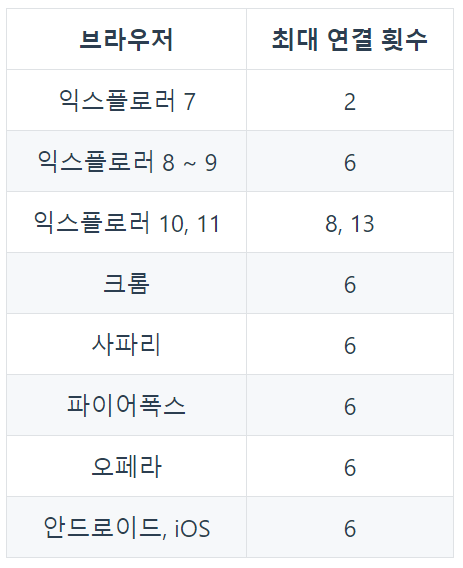<br />
HTTP 요청 숫자를 줄이는 것이 웹 애플리케이션의 성능을 높여줄 뿐만 아니라 
사용자가 사이트를 조작하는 시간을 앞당겨 줄 수 있다.
	- 클라이언트에서 서버에 HTTP 요청을 보내기 위해서는 먼저 TCP/IP가 연결되어야 한다
웹팩을 이용해 여러 개의 파일을 하나로 합치면 위와 같은 브라우저별 HTTP 요청 숫자 제약을 피할 수 있다.
<br />

#### 2.2.3. Dynamic Loading & Lazy Loading 미지원
Require.js와 같은 라이브러리를 쓰지 않으면 동적으로 원하는 순간에 모듈을 로딩하는 것이 불가능 했다. 
그러나 이젠 웹팩의 **Code Splitting 기능을 이용하여 원하는 모듈을 원하는 타이밍에 로딩**할 수 있다.

<br /><br /><br />

## 3. Node.js와 NPM
웹팩을 사용하기 위해서는 Node.js와 NPM이 컴퓨터에서 설치되어 있어야 한다.<br />
그리고 이 도구들에 대해 어느 정도 배경 지식이 있으면 웹팩을 다루는데 도움이 된다.<br />
<br />

### 3.1. Node.js
- Node.js는 브라우저 밖에서도 자바스크립트를 실행할 수 있는 환경을 의미한다.
- Node.js가 나오기 전까지는 자바스크립트가 브라우저의 동작을 제어하는데 사용되었고 브라우저에서만 실행할 수 있었지만 이제는 **Node.js로 자바스크립트를 브라우저 밖에서도 실행**할 수 있게 되었다.
- node.js 파일은 **LTS 버전으로 설치**
<br />

### 3.2. NPM 소개
- NPM = Node Package Manager
- 공식문서 = https://www.npmjs.com
- npm은 자바스크립트 프로그래밍 언어를 위한 패키지 관리자<br />
(자바스크립트 라이브러리를 관리해주는 도구)
- NPM 사이트는 전세계 모든 자바스크립트 라이브러리(jQuery, tensorflow 등)들을 관리
	- 공개저장소
	- 검색해서 모든 자바스크립트 라이브러리를 확인할 수 있다
		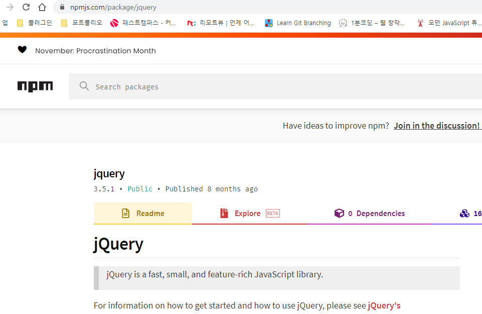<br />
<br />

### 3.3. NPM 시작하기
1. 터미널 창에서 node 버전과 npm 버전을 명령어를 입력하여 확인
	```
	node -v    // node 버전
	npm -v     // npm 버전
	```
	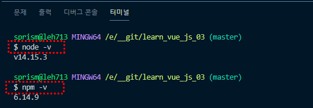<br />
	<br />
2. powersell 로 되어 있을 경우, 해당 버전 확인이 안 되는 경우가 있다.<br />
(https://github.com/eunhye8767/learn_vue_js_01 - 10.3번 참고)

3. npm 폴더를 만들고 open in Terminal 클릭<br />
	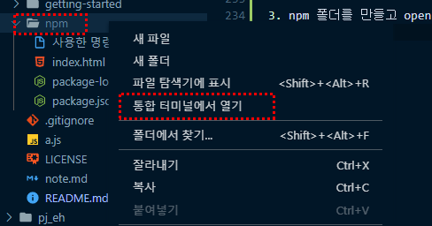<br />

4. 터미널에서 경로가 해당 npm 폴더로 바뀐 것을 확인할 수 있다<br />
	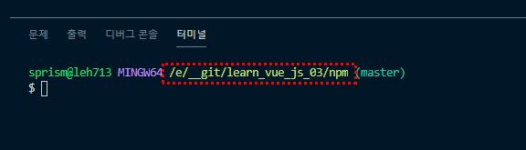<br />

5. [ 터미널 ] npm init 명령어 실행
<br />

### 3.4. NPM 초기화 명령어 - init
1. [ 터미널 ] npm init 명령어 실행
2. 1번 영역 참고, package name(프로젝트 이름 등), version, decription 등 항목별로 입력하라는 메세지가 보여진다<br />2번 영역 참고, 입력한 값이 맞는 지 한 번더 명시해준다.<br />3번 영역 참고, 이대로 진행할 건지 마지막으로 물어본다.<br />
	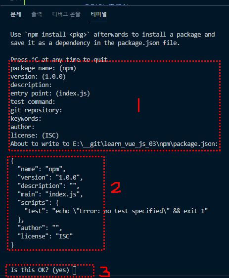<br />

3. 물음에 답을 하면 생성한 npm 폴더 안에 package.json 파일이 생성되고 그 안에 내가 입력한 값(2번 영역)들이 기재되어 있다.<br />
	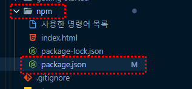<br />
	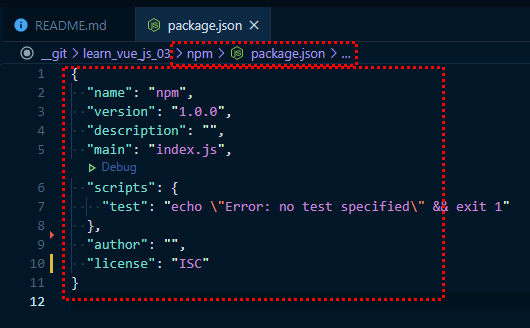<br />

4. 생성된 package.json 파일을 삭제한다
5. [ 터미널 ] npm init -y 명령어를 입력한다
	- npm init -y 명령어는 package name, version 등 항목별로 입력하는 란을 기본값으로 지정한 후 자동으로 package.json 파일까지 생성한다.<br />
	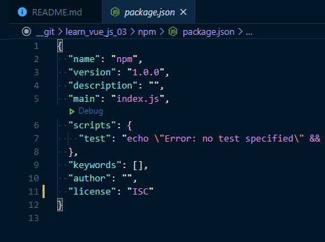<br />
	<br />

### 3.5 NPM 설치 명령어 - install
1. jquery 를 설치해본다
2. [ 터미널 ] npm install jquery 명령어 입력
	- 설치 명령어 : npm install *** 
3. npm 폴더 안에 nodo_modules/jquery 폴더가 생성되었다<br />
	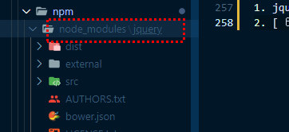<br />
4. 일반적으로 특정 라이브러리가 설치되었을 때에는 nodo_modulex 폴더 아래에 jquery 처럼 해당 폴더가 생성이 되고 그 폴더 아래에 파일들이 저장되어 있다
	- 설치된 라이브러리 폴더 안에 dist 폴더 안에서 파일이 확인이 된다
	- 설치 예시 : jquery/dist/jquery.js 
		- jquery.js 파일을 열면 버전 등의 정보 코드들을 확인할 수 있다<br />
			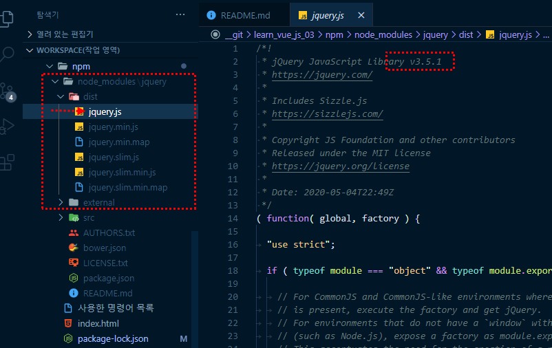<br />
		- **npm/package.json** 파일에서 설치된 **jquery 버전도 확인**할 수 있다<br />
			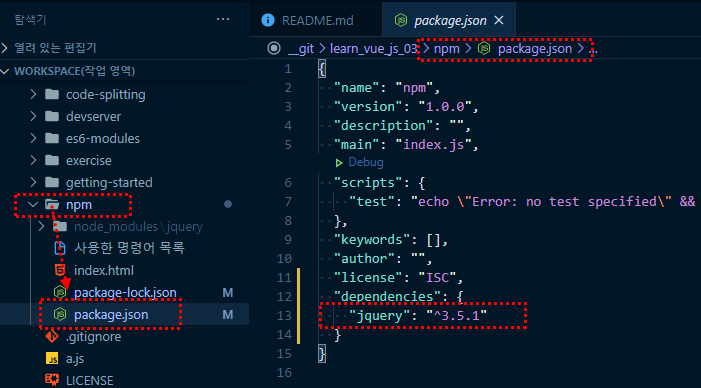<br />
<br />

### 3.6. NPM을 사용하는 이유
1. npm/package.json : **각각의 라이브러리 목록과 버전을 확인**할 수 있다.<br />
	- 각각의 라이브리별 버전 관리가 용이하다.<br />
	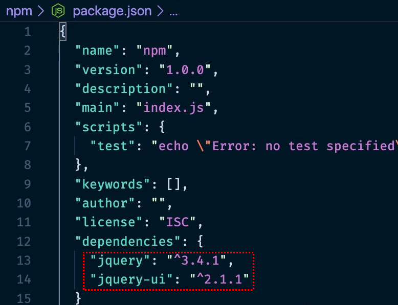<br />
2. 특정 라이브러리 검색하여 cdn 주소를 불러오지 않아도 **간편하게 명령어를 입력하여 해당 라이브러리 설치**가 가능하다.
	- 예: npm install jquery-ui / npm install jquery
<br />

## 4. NPM(Node Package Manager)
### 4.1. NPM 지역 설치 명령어와 제거 명령어 - uninstall
1. npm install gulp 명령어를 입력하여 gulp를 설치한다
	- npm/package.json 파일에 해당 라이브러리가 설치된 것을 확인할 수 있다<br />
	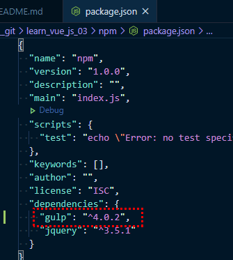<br />
2. 설치가 완료된 후에 npm uninstall gulp 명령어를 입력하여 삭제한다
	- npm/package.json 파일에서 해당 라이브러리가 삭제된 것을 확인할 수 있다<br />
	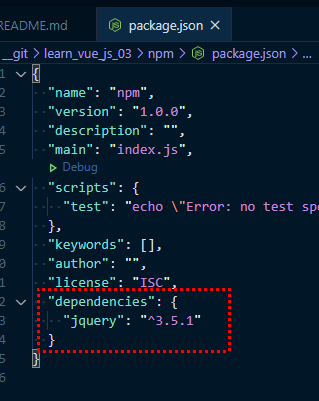<br />
	<br />

### 4.2. NPM 전역 설치 명령어 - install --global
1. install 뒤에 설치옵션(실행옵션) --global 을 넣어본다
	```
	npm install gulp --global
	```
2. permission 에러로 설치가 안되면 sudo 를 추가하여 명령어를 입력한다
	```
	sudo npm install gulp --global
	```
3. 설치가 완료되면 **라이브러리명@버전**을 확인할 수 있다.
	- 스펠링을 잘못기재하여 전혀 다른 라이브러리를 설치할 수 있으니 해당 부분을 확인한다
	- 쓰이지 않는 라이브러리의 경우 버전이 낮기 때문에 해당 부분을 확인한다
	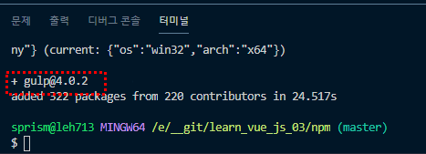<br />
4. npm install gulp 로 설치했을 때엔 npm/node_modules 폴더에 해당 설치된 라이브러리의 폴더가 자동 생성되었었는데 **--global 옵션으로 설치했을 때앤 node_modules 폴더에 해당 라이브러리의 폴더가 생성되지 않는다.**
5. 설치가 완료된 gulp 명령어를 입력한다
	- 시스템 상에서 명령어를 인식할 수 있게 제공하는 라이브러리들이 몇 개 있는데 그 중에 하나가 gulp 이다.
	```
	gulp
	```
	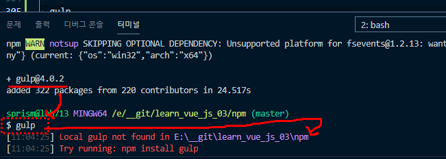<br />
<br />

### 4.3. 전역으로 설치된 라이브러리 경로 확인
1. NPM 전역 설치 경로
	- --global 옵션 명령어로 설치된 라이브러리는 OS에 따라 해당 폴더 경로에 설치된다
	```
	# window
	%USERPROFILE%\AppData\Roaming\npm\node_modules

	# mac
	/usr/local/lib/node_modules
	```
	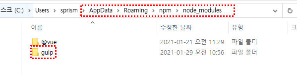<br />
2. 시스템에서 그 라이브러리를 제공하는 CLI, 명령어 인식 기능들을 활용하기 위해서 --global를 설치한다.
<br />

### 4.4. 지역 설치와 전역(--global) 설치 비교 정리
- **NPM 지역 설치**
	- NPM 초기화 명령어로 package.json 파일을 생성하고 나면 해당 프로젝트에서 사용할 자바스크립트 라이브러리를 설치하게 된다. 이때 명령어로는 아래와 같다.
		```
		npm install jquery --save-prod
		```
	- 지역 설치 명령어의 경우 명령어 옵션으로 **--save-prod를 붙이지 않아도 동일한 효과**가 난다<br />(--save-prod 생량 가능)
	- **install 대신 i 를 사용**해도 된다
		```
		npm i jquery
		```
	- npm install 명령어로 라이브러리를 설치하면 **해당 프로젝트의 node_modules 라는 폴더가 생성**된다. 그리고 그 폴더 아래에 해당 라이브러리 파일들이 설치되어 있는 것을 확인할 수 있다.
	<br />
- **NPM 전역 설치**
	- NPM 전역설치는 지역설치처럼 프로젝트에서 사용할 라이브러리를 불러올 때 사용하는 것이 아니라 **시스템 레벨에서 사용할 자바스크립트 라이브러리를 설치할 때 사용**한다.
		```
		npm install gulp --global
		```
	- 라이브러리가 설치되고 나면 이제 명령어 실행 창에 해당 라이브러리 이름을 입력했을 때 명령어를 인식한다
		```
		gulp
		```
	- 전역 설치 명령어 옵션 **--global 대신 -g 를 사용**해도 된다
	- 시스템 레벨의 폴더 경로에 저장이 된다. ([4.3. 참고](#43-전역으로-설치된-라이브러리-경로-확인))
<br />

### 4.5. 지역 설치 명령어 옵션 - --save-dev(-D)
- NPM 지역 설치 옵션 2가지
	- NPM 지역 설치에 자주 사용되는 2가지 옵션은 다음과 같다
		```
		npm install jquery --save-prod
		npm install jquery --save-dev
		```
	- 위 명령어를 축약할 수 있다
		```
		npm i jquery
		npm i jquery -D
		```
- **--save-dev 또는 -D 설치 옵션으로 명령어를 실행**했을 경우
	1. vue 라이브러리를 예시로 설치한다
		```
		npm install vue --save-dev

		// 축약형
		npm i vue -D
		```
	2. node_modulex 폴더 아래에 vue 폴더가 생성된 것을 확인할 수 있다
	3. npm/package.json 파일에서 devDependencies 객체에 vue가 추가된 것을 확인할 수 있다
		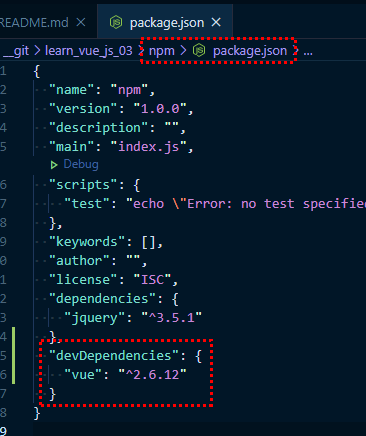<br />
<br />

### 4.6. dependencies와 devDependencies의 차이점
- **dependencies**
	- npm install 또는 npm i 로 설치했을 때 dependenices에 추가가 된다
	- 애플리케이션 로직(동작)을 구현하는 것에 연관이 있다 (= 화면의 로직과 직접적 연관)
		- 예1) jquery : 화면의 DOM을 조작하는 유틸성 라이브러리
		- 예2) jqeury-ui : 화면 DOM 동작을 도와주는 부가적인 라이브러리
	- dependencies 적용될 라이브러리 : vue, react, angular, chart 등

	<br />
- **devDependencies**
	- npm install --save-dev, npm install -D 로 설치했을 때 devDependencies에 추가가 된다<br />(install 은 i 로 축약 가능!!)
	- **개발을 할 때 도움을 주는 개발용 라이브러리**, 개발 보조 라이브러리 
	- devDependencies 적용될 라이브러리 : webpack, js-compression, sass 등
<br />

### 4.7. 개발용 라이브러리와 배포용 라이브러리 구분하기
- **NPM 지역 설치를 할 때 해당 라이브러리가 배포용(dependencies)인지 개발용(devDependencies)인지 꼭 구분**해주어야 한다.
	- 예를 들어, jqeury 와 같이 화면 로직과 직접적으로 관련된 라이브러리는 배포용으로 설치해야 한다.
	- 설치된 배포용 라이브러리는 npm run build 로 빌드를 하면 최종 애플리케이션 코드 안에 포함된다.
	```
	// 배포용 라이브러리 설치
	npm i jquery
	```
	```
	// package.json
	{
	  "dependencies": {
	    "jquery": "^3.4.1"
		}
	}
	```
- **설치된 개발용 라이브러리(devDependencies)는 빌드를 했을 때 애플리케이션에 포함되지 않는다.**
	- 반대로, 배포용 라이브러리(dependencies)에 필요없는 라이브러리가 들어가면서 빌드시간이 오래 걸리는 경우가 발생한다. **배포용과 개발용 라이브러리를 구분해서 적용**해주어야 한다.
- 예로, 라이브러리 [express](#https://www.npmjs.com/package/express) 를 봤을 때<br />Installation을 보면 npm install express 로 되어 있다. Installation 을 확인하여 설치하면 된다
- 라이브러리 별 안내 가이드에 따라 해도 되지만,<br />서비스 내 로직, 애플리케이션을 구현할 때 화면 조작에 직접적인 영향이 없으면 devDependencies 에 적용해도 된다.
<br />
<br />
<br />

## 5. 웹팩 시작하기
### 5.1. 웹팩 소개
- 웹팩이란 최신 프론트엔드 프레임워크에서 가장 많이 사용되는 모듈 번들러(Module Bundlier)이다. 
	- 모듈 번들러란 웹 애플리케이션을 구성하는 자원(HTML, CSS, Javascipt, images 등)을 모두 각각의 모듈로 보고 이를 조합해서 병합된 하나의 결과물을 만드는 도구를 의미한다.
		- 모듈이란?
			- 모듈이란 프로그래밍 관점에서 특정 기능을 갖는 작은 코드 단위
			- 예시) 자바스크립트 코드
				```javascript
				// main.js
				function sum(a, b) {
					return a + b;
				}

				function substract(a, b) {
					return a - b;
				}
				```
		- **모듈 번들링이란?**
			- 웹 애플리케이션을 구성하는 몇 십, 몇 백개의 자원들을 하나의 파일로 병합 및 압축해주는 동작을 모듈 번들링이라고 한다. (= 파일들을 하나로 합친다)<br />
				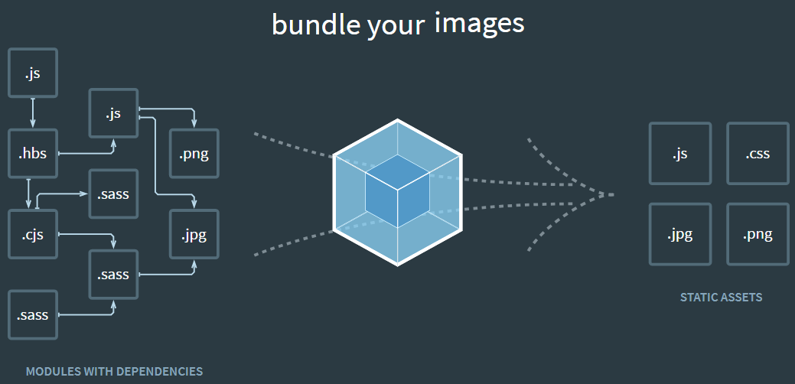<br />
			- 하나의 웹 서비스를 구성하는 모든 파일들을 해석한 후(파일들의 연결 관계를 파악) 그 파일들을 하나로 합쳐주는 것을 모듈 번들러 라고 이해하면 된다.
			- 빌드, 번들링, 변환 이 세 단어 모두 같은 의미이다.
<br />

### 5.2. 튜토리얼 파트 1 - 웹팩 적용 전
- 웹팩 맛보기 튜토리얼 :
	- [참고URL](https://joshua1988.github.io/webpack-guide/getting-started.html)
	- 웹팩을 가볍게 맛볼 수 있는 튜토리얼 진행
	- 튜토리얼로 웹팩을 실행할 수 있는 개발환경을 구성하고 빌드 과정을 경험해 볼 수 있을 것
<br />

- **개발 환경 구성**
	- Node.js LTS Version(버전 10이상)
	- NPM 버전 6 이상
<br />

#### 실습 절차 - 웹 페이지 자원 구성
1. 새폴더를 만들고 만든 폴더 기준으로 터미널 창을 연다<br />
	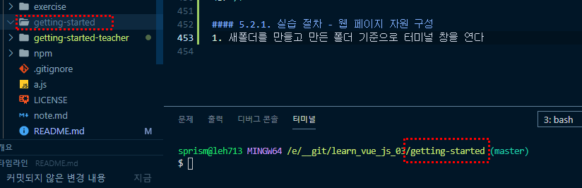<br />
2. npm init -y 명령어 입력, package.json 파일 자동 생성
3. 대부분의 프로젝트의 기본적으로 npm이 동반된다. npm init 또는 package.json 을 설정한다.
4. webpack, webpack-cli 를 설치한다 
	- -D 또는 --save-dev 옵션 설정으로 개발용 라이브러리로 설치한다
	- 개발용 라이브러리는 빌드 시 애플리케이션에 적용되지 않는다
	```
	npm i webpack webpack-cli -D
	```
5. webpack, webpack-cli 가 설치가 완료되면 package.json 파일 - devDependencies 객체에 추가된 것을 확인할 수 있다<br />
	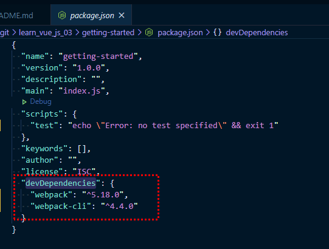<br />
6. lodash 도 설치한다 (배포용 라이브러리)
	- 설치가 완료되면 package.json 파일 - dependencies 항목에 추가된 것을 확인할 수 있다
	- lodash 라이브러리 : 자바스크립트 유틸리티 라이브러리
	```
	npm i lodash
	```
7. (새로 만든 폴더)프로젝트 루트 레벨에 index.html 파일을 만들고 아래 코드를 적용한다
	```html
	<html>
	  <head>
	    <title>Webpack Demo</title>
	    <script src="https://unpkg.com/lodash@4.16.6"></script>
	  </head>
	  <body>
	    <script src="src/index.js"></script>
	  </body>
	</html>
	```
8. (새로 만든 폴더)프로젝트 루트 레벨에 src 폴더를 생성하고 그 안에 index.js 파일 생성하고 아래 코드를 적용한다
	```javascript
	function component() {
	  var element = document.createElement('div');

	  /* lodash is required for the next line to work */
	  element.innerHTML = _.join(['Hello','webpack'], ' ');

	  return element;
	}

	document.body.appendChild(component());
	```
9. index.html 파일을 Live Server 로 실행한다.
<br />

### 5.3. 튜토리얼 파트 2 - 웹팩 적용 후
#### 실습 절차 - 웹팩 빌드를 위한 구성 및 빌드
1. 웹팩 빌드 및 빌드 결과물로 실행하기 위해 index.js, index.html 파일을 아래 코드로 변경한다.
	```javascript
	// index.js
	import _ from 'lodash';

	function component() {
	  var element = document.createElement('div');

	  /* lodash is required for the next line to work */
	  element.innerHTML = _.join(['Hello','webpack'], ' ');

	  return element;
	}

	document.body.appendChild(component());
	```
	```html
	<!-- index.html -->
	<html>
	  <head>
	    <title>Webpack Demo</title>
	    <!-- <script src="https://unpkg.com/lodash@4.16.6"></script> -->
	  </head>
	  <body>
	    <!-- <script src="src/index.js"></script> -->
	    <script src="dist/main.js"></script>
	  </body>
	</html>
	```
2. 위와 같이 적용을 하면 웹팩을 실행시킬 수 있는 상태가 되었기 때문에 scripts 라는 커스텀 명령어를 추가해서 build 라는 명령어를 실행해서 webpack 실행시키려고 한다
	- 웹팩 빌드 명령어를 실행하기 위해 package.json 파일에 아래 내용 추가
		```javascript
		"scripts": {
		  "build": "webpack"
		}
		```
3. npm run build 명령어 입력 후, index.html 페이지를 Live Server 로 확인한다
	```javascript
	npm run build
	```
4. 프로젝트 루트 폴더에 dist/main.js 파일이 생성된 것을 확인할 수 있다<br />
	- main.js 파일을 보면 코드가 한 줄로 길게 나열되어 적용된 것을 확인할 수 있다.<br />
	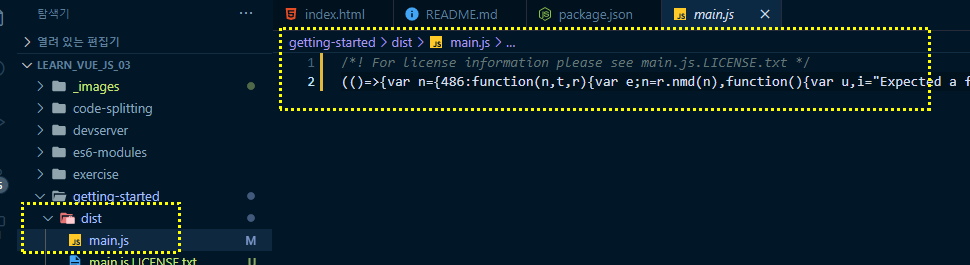<br />
	<br />

### 5.4. 튜토리얼 파트 3 - mode 적용
1. package.json 에 build: webpack 으로 저장한 후 npm run build 를 실행하게 되면 warning 문구를 볼 수도 있는데, 이것은 웹팩 3버전과 4버전의 차이로 이해하면 된다.
	- mode : 'developement' , 'production' , 'none'
	- 기본적으로 mode 는 'none' 으로 설정하여 진행할 예정이다. (수업진행방식)<br />
	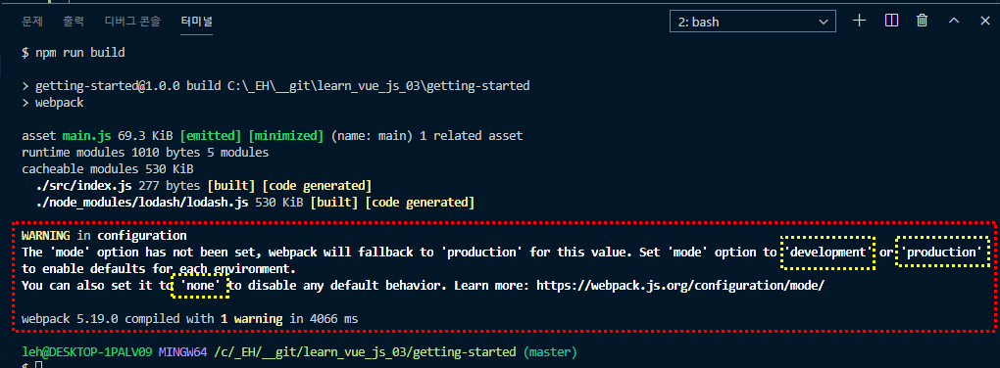<br />
2. [ package.json ] scripts - build: webpack 에 mode 값을 none로 적용한다
	- none 은 wabpack --mode=none 으로 적용
		```javascript
		"scripts": {
		  "build": "webpack --mode=none"
		}
		```
3. 빌드를 실행시킨다
	```
	npm run build
	```
4. **mode 를 none 으로 적용**하여 빌드를 실힝하면 
	1. **warning 문구가 사라진 것**을 확인할 수 있다.
	2. **dist/main.js 파일이 바뀐 것**을 확인할 수 있다.
		- 한줄로 길게 나열된 형태에서 아래와 이미지처럼 알아보기 쉽게 코드 정렬이 바뀐것을 확인할 수 있다<br />
		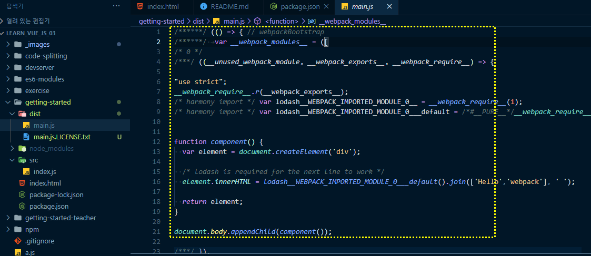<br />
<br />

### 5.5. 튜토리얼 파트 4 - 웹팩 설정 파일 적용
1. 위와 같이 설정을 하면 dist 폴더에 main.js 로 변환이 되었는데 dist 폴더가 아닌 다른 폴더에 설정하려고 할 떈 build에 한 줄로 계속 붙여 나가야 한다. (아래 코드 참고)
	- **웹팩을 사용하게 되면 많은 옵션들을 추가해야 하기 때문에 아래 코드처럼 한 줄로 관리하기엔 문제가 많다.**
	- 따라서, **한 줄로 관리하는 것이 아닌 웹팩 설정 파일을 이용하여 적용**한다.
	```javascript
	// package.json
	"scripts": {
	  "build": "webpack --mode=none --entry=src/index.js --output=public/output.js"
	}
	```
2. 프로젝트 **루트 폴더에 웹팩 설정 파일 webpack.config.js 을 생성**한다<br />
	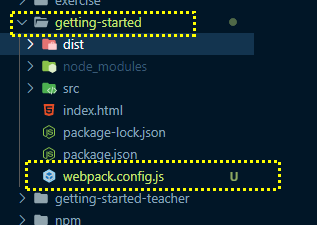<br />
3. [ webpack.congig.js ] 모듈 문법을 이용하여 파일을 작성한다.(아래 코드 적용)
	```javascript
	var path = require('path');

	module.exports = {
	  mode: 'none',
	  entry: './src/index.js',
	  output: {
	    filename: 'main.js',
	    path: path.resolve(__dirname, 'dist')
	  }
	};
	```
4. [ package.json ] build: 'webpack'로 변경한다.
	```javascript
	"build": "webpack"
	```
	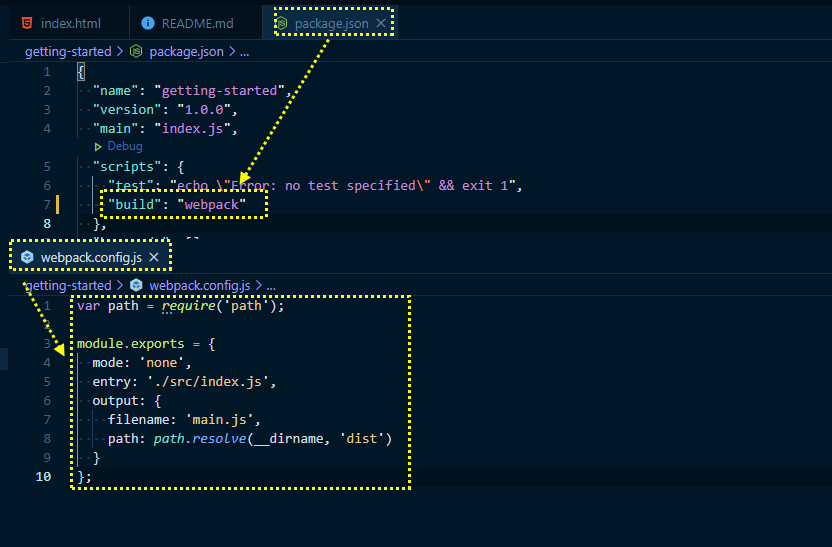<br />
5. 빌드를 실행시킨다
	```
	npm run build
	```
	<br />

### 5.6. 튜토리얼 파트 5 - 웹팩 설정 파일 설명
1. var path = require('path');
	- node js의 모듈 문법
	- path 라는 노드 js의 ptth 라이브러리를 들고와서 로딩해서 path 라는 변수에 담는다<br />
	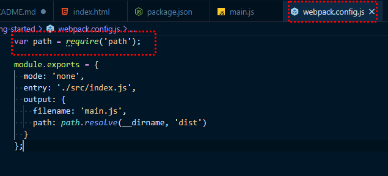<br />
2. path.resolve(__dirname, 'dist') 라는 API를 사용하게 된다<br />
	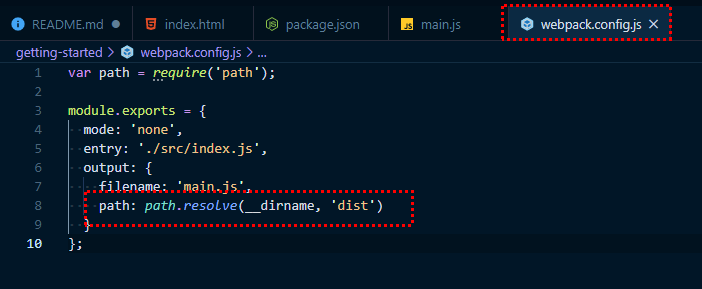<br />
3. node js 의 path 관련 설명 [공식문서 바로가기](https://nodejs.org/api/path.html#path_path_resolve_paths)
4. entry : 변환할 파일 대상
5. output : entry 파일을 어떤 경로에 저장할 것인가<br />
	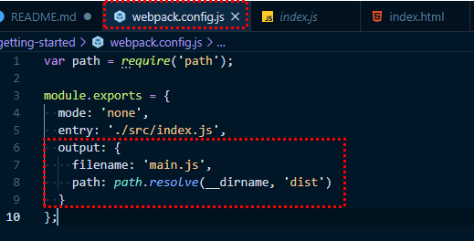<br />
<br />

### 5.7. 튜토리얼 파트 6 - 튜토리얼 소스 분석
1. [lodash join() API 문서](https://lodash.com/docs/4.17.15#join)
2. cdn 으로 불러온 lodash 라이브러리를 npm 으로 설치하여 index.html 파일을 수정하였다
	```html
	<!-- index.html -->
	<html>
	  <head>
	    <title>Webpack Demo</title>
	    <script src="https://unpkg.com/lodash@4.16.6"></script>
	  </head>
	  <body>
	    <script src="src/index.js"></script>
	  </body>
	</html>
	```
3. cdn 으로 불러온 lodash@4.16.6 스크립트 주소와 js/index.js 는 주석(삭제) 처리.
	```html
	<!-- index.html -->
	<html>
	  <head>
	    <title>Webpack Demo</title>
	    <!-- <script src="https://unpkg.com/lodash@4.16.6"></script> -->
	  </head>
	  <body>
	    <!-- <script src="src/index.js"></script> -->
	  </body>
	</html>
	```
4. src/index.js 파일에 설치한 lodash 라이브러리를 ES6 문법으로 import 한다
	- _ 라는 변수에 lodash 변수를 담았다
	- lodash 의 .join API를 이용하여 Hello webpack 문구를 화면에 노출한다
	```
	import _ from 'lodash';

	function component() {
	  var element = document.createElement('div');

	  /* lodash is required for the next line to work */
	  element.innerHTML = _.join(['Hello','webpack'], ' ');

	  return element;
	}

	document.body.appendChild(component());
	```
5. webpack.config.js 에 작성한 코드에 맞게 생성된 dist/main.js 를 인클루드 해준다.
	```html
	<!-- index.html -->
	<html>
	  <head>
	    <title>Webpack Demo</title>
	    <!-- <script src="https://unpkg.com/lodash@4.16.6"></script> -->
	  </head>
	  <body>
	    <!-- <script src="src/index.js"></script> -->
	    <script src="dist/main.js"></script>
	  </body>
	</html>
	```
<br />